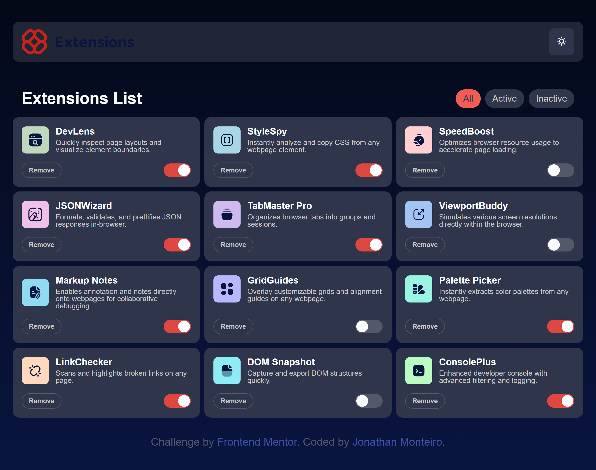
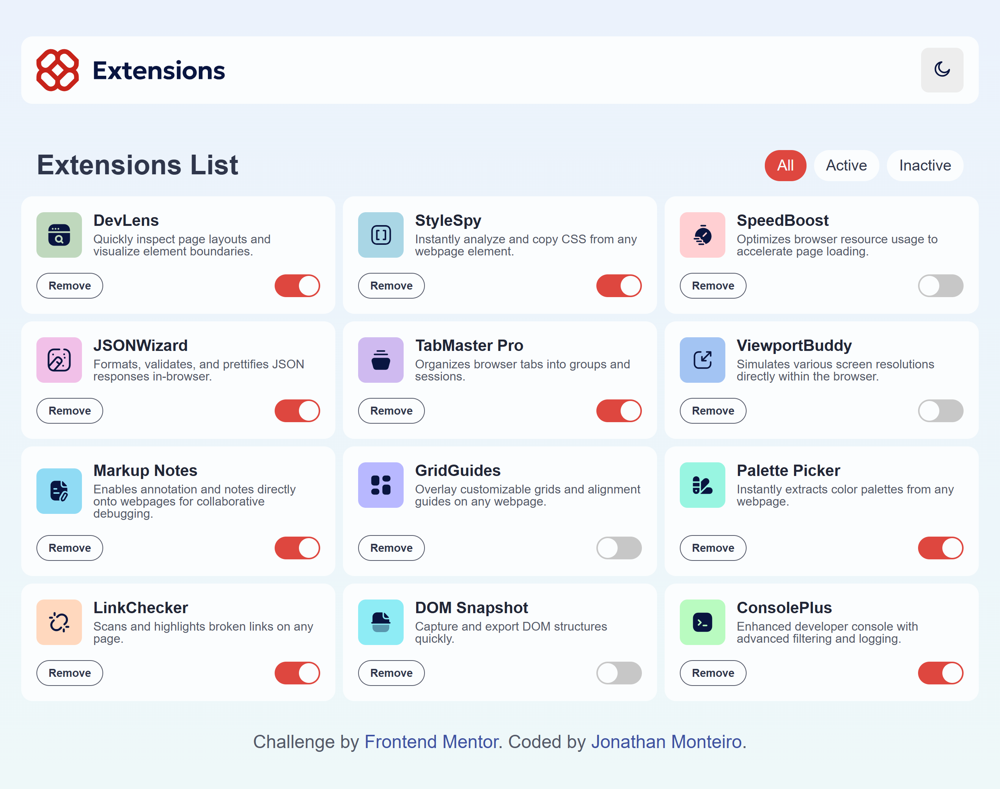

# Frontend Mentor - Gerenciador de Extensões do Navegador - Interface

Este é o resultado do meu trabalho para o desafio da interface do gerenciador de extensões de navegador no [Frontend Mentor](https://www.frontendmentor.io/challenges/browser-extension-manager-ui-yNZnOfsMAp). Os desafios do Frontend Mentor me ajudam a aprender a programar construindo projetos mais realistas.

## Conteúdo

- [Visão Geral](#visão-geral)
  - [O desafio](#o-desafio)
  - [Como ficou](#como-ficou)
  - [Links](#links)
- [Meu Processo](#meu-processo)
  - [Construido com](#construido-com)
  - [O que aprendi](#o-que-aprendi)
  - [Desenvolvimento Contínuo](#desenvolvimento-contínuo)
  - [Recursos Úteis](#recursos-úteis)
- [Autor](#autor)

## Visão Geral

### O desafio

O objetivo é construir a tela de um gerenciador de extensões de navegador que fique o mais parecido possível com o modelo.

Os usuários devem ser capazes de:

- [x] Alternar as extensões entre os estados ativo e inativo
- [x] Filtrar extensões ativas e inativas
- [x] Remover extensões da lista
- [x] Selecionar o tema de cores
- [x] Ver a layout ideal para a interface dependendo do taanho da tela do dispositivo
- [x] Ver os estados de passar o mouse (hover) e foco para todos os elementos interativos da página

## Meu processo

**Mobile dark-theme**

**Mobile light-theme**

**Desktop dark-theme**

**Desktop light-theme**

### Construido com

- HTML5
- CSS 
  - Variáveis CSS
  - Flexbox 
  - Grid 
- JavaScript 
  - DOM 
  - Fetch API 

### O que aprendi

Nesse projeto, aprendi muita coisa legal:

- Usei o **Flexbox e o Grid** para organizar os elementos na tela.
- Também usei as **Variáveis CSS** para deixar o código mais organizado e fácil de fazer alterações.
- Deixei as pastas do projeto organizadas para facilitar a estilização.
- Usei o **DOM** para manipular os elementos como criar e tirar elementos da página de forma dinamica.
- Colocar em prática muitas coisas que eu aprendi sobre **DOM**, **CSS** e **HTML** me deixou bem animado, ja estou pronto para novos desafios.

### Desenvolvimento Contínuo

Meu objetivo é continuar a resolver desafios cada vez mais complexos para aprimorar minhas habilidades em desenvolvimento frontend. Quero aprofundar meus conhecimentos em:

- Manipulação avançada do DOM.
- CSS avançado e técnicas de layout.
- Conceitos de JavaScript mais complexos.

### Recurso Úteis

- [Curso em Vídeo (HTML)](https://www.cursoemvideo.com/) - Os cursos do Professor Guanabara foram fundamentais para construir uma base sólida em HTML, que pude aplicar neste projeto.
- [Curso em Vídeo (JavaScript)](https://www.cursoemvideo.com/) - Da mesma forma, o curso de JavaScript me forneceu os conceitos necessários para implementar a interatividade e a manipulação dinâmica dos elementos.
- [Gemini](https://gemini.google.com/) - O Gemini me ajudou a entender e dividir o projeto em varias partes menores, me ajudando no processo de implementação e resolução de todo o processo lógico do projeto.

## Autor

Jonathan Monteiro